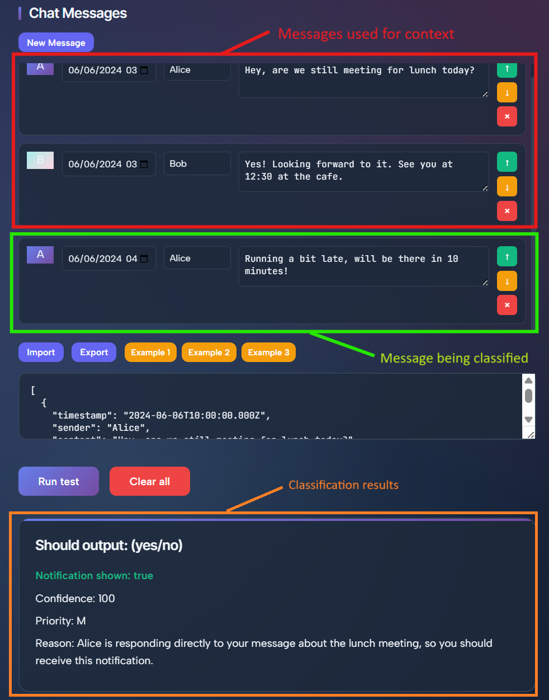

# AI-Notification-Filter

This project acts as the backend to the complete AI-notification filter project. It serves as the proof-of-concept for an AI notification filter designed to filter notifications according to a natural language prompt by the user.

It interfaces with various LLMs using a GMI Cloud API in order to determine whether notifications should be shown or hidden from the user.

## Setup

Prior to running the program, you'll need to create a `.env` file in the root of the project and add the GMI Cloud API key in order to run the program. See `.env.example` if you are unsure what to put in.

Once this is done, you can simply run `npm install` to install the relevant dependencies before moving on the steps in [usage](#usage).

## Usage

After setting up the project, simply run `npm run dev` with node installed to create a local development server. From here, you should be able to access it in your browser at the URL specified in the terminal (most likely [http://localhost:9000](http://localhost:9000)).

Once you can access the web interface, you can either play around with the examples (make sure to import the messages) or create your own simulated chat messages/prompts.

When running the test, the program will decide whether to notify the user for the last (bottom) message in the "Chat Messages" section. The previous messages (up to 10) are then used context to understand the conversation. See below as an example for the interface:

## Project Structure

All backend code that is to be integrated with relevant applications is available under `src/ai_api`. Source code under `src/test_ui` is related to running the test UI and provides an easy to use interface to test things out.

## Support

If you require support, feel free to create an issue detailing any problems and we'll try to resolve things when possible although precise timeframes are not guaranteed.

## Authors and acknowledgement

This project was developed as part of the Hack the Stack hackathon in less than 24 hours including time to present.

The following people helped develop the program:
- [Ciaran Gruber](https://linkedin.com/in/ciaran-gruber) - Developed the API to the chat interface including prompt engineering for the system prompt
- [Jessica Song](https://www.linkedin.com/in/jesswsong/) - Redesigned to UI to be demostration-ready with additional features for recalling examples
- [Romanus Angina](https://www.linkedin.com/in/romanus-angina/) - Did key development during the event for integrating this backend with Slack (See more at the [Slack Optimiser repository](https://github.com/romanus-angina/slackoptimizer))

## Licence

See the [Licence](./LICENCE) file for more information. If not present, this repository at its current state is licenced under the standard MIT licence

## Project Status

As of right now, this repository is generally complete and is unlikely to see further commits with further development expected to be present in the [slack optimiser](https://github.com/romanus-angina/slackoptimizer) repository.